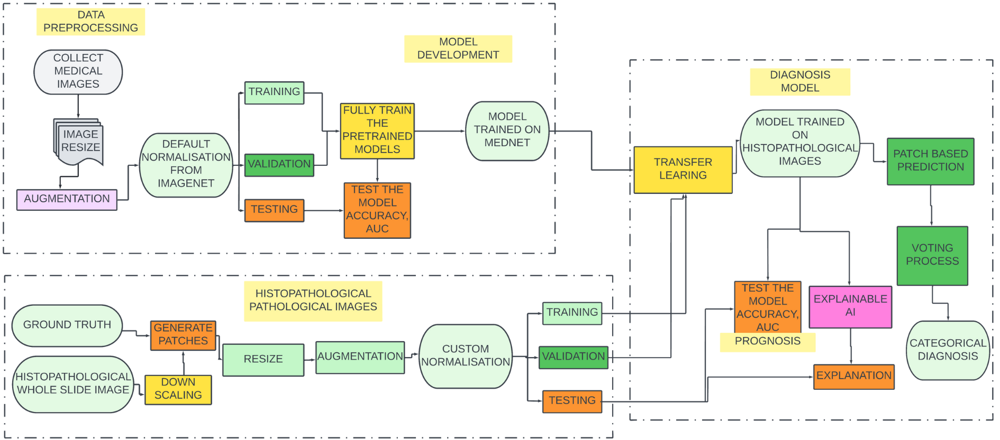
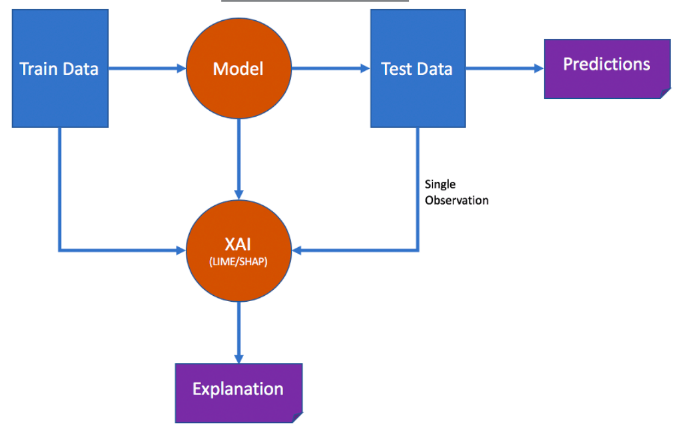
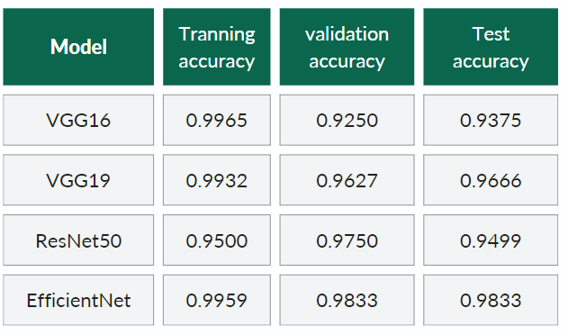
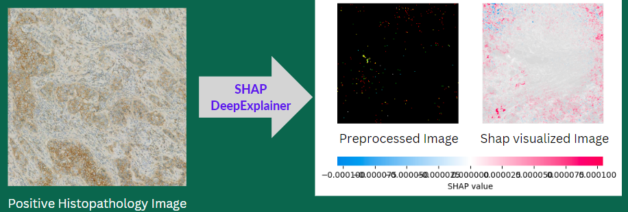
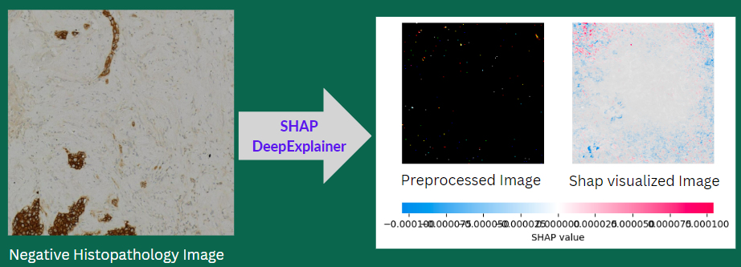
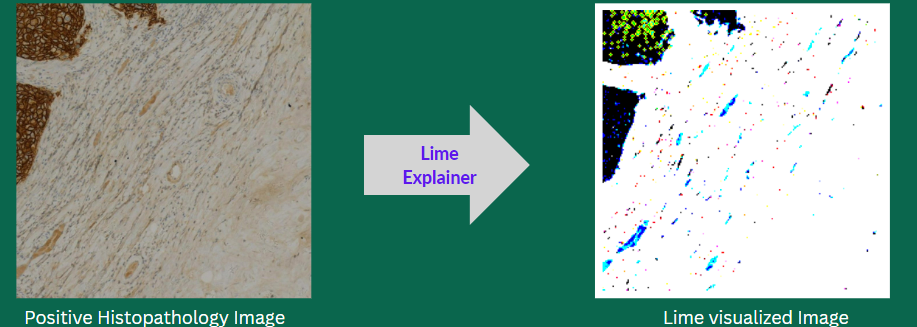
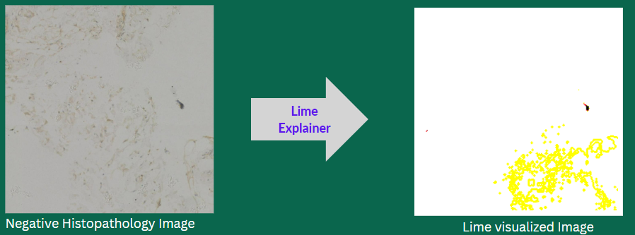

[comment]: # "This is the standard layout for the project, but you can clean this and use your own template"

# Applying deep learning on histological images of lymph tissues

#### Team

- E/17/230, Nishankar S, [email](mailto:e17230@eng.pdn.ac.lk)
- E/17/256, Piriyaraj S, [email](mailto:e17256@eng.pdn.ac.lk)
- E/17/358, Varanaraj N, [email](mailto:e17358@eng.pdn.ac.lk)

#### Supervisors

- Dr. Swarnalatha Radhakrishnan, [email](mailto:swarnar@eng.pdn.ac.lk)
- Dr. Pratheepan, [email](mailto:pratheepan@uwu.ac.lk)

#### Table of content

1. [Abstract](#abstract)
2. [Related works](#related-works)
3. [Methodology](#methodology)
4. [Experiment Setup and Implementation](#experiment-setup-and-implementation)
5. [Results and Analysis](#results-and-analysis)
6. [Conclusion](#conclusion)
7. [Publications](#publications)
8. [Links](#links)

---

## Abstract

Histopathology whole slide images contain valuable
information for many medical applications such as cancer diagnosis. The recent advancement of Deep Learning (particularly
Transfer Learning) allowed using the computer systems for
efficient and effective diagnosis in histopathology imaging. However, these approaches have some limitations: 
a) the pre-trained transfer learning models lack medical imaging features. 
b) These algorithms show reasonably high accurate predictions but lack transparency. 
c) limited labeled images in the histopathology images.

In this study, we address the issues mentioned above. First,
we briefly discuss two histopathology imaging approaches. We
mainly focus on transfer-learning approaches in medical imaging,
particularly the need for an efficient transfer-learning approach
for histopathology imaging. We also address explainable AI
approaches and the need to ensure the reliability of AI in
computational histopathology. A brief detail of self-supervised
learning approaches is included to provide the details of handling
unlabelled datasets. Finally, a discussion is provided at the end
of the study

## Related works

The literature review provides a comprehensive overview of existing research relevant to histopathology, DL, and associated challenges. Key topics covered include whole slide images (WSI), patch-based analysis, transfer learning (TL) in medical imaging, and explainable AI (XAI). Notable studies are referenced to support the proposed approach, including research showcasing the potential of DL algorithms in detecting metastases, the effectiveness of TL in medical imaging, and the importance of XAI in enhancing model interpretability. The related works section highlights the significance of features learned from medical images, the limitations of traditional staining techniques, and the need for domain-specific datasets in transfer learning. Additionally, the review emphasizes the importance of XAI in medical imaging, providing interpretable explanations and insights into DL model decisions. Overall, the related works section sets the stage for the proposed research by summarizing key findings and gaps in existing literature.

## Methodology

The proposed methodology outlines a multi-stage approach to enhance the accuracy of DL models in histopathological image analysis. The research focuses on addressing challenges associated with traditional staining techniques (H&E) and the cost implications of resorting to immunohistochemistry (IHC). The key elements of the methodology include:

1. **Collection of Diverse Medical Image Datasets:**

   - Compilation of various medical image datasets, including retinal images, histopathology photos, and other relevant images from the same field.
   - Ensuring diversity in datasets to represent a wide range of properties and attributes.

2. **Model Creation and Pre-training:**

   - Training a DL model using the gathered medical image datasets. The specific architecture and classification layer used in this initial training phase are not crucial as they will be adjusted in subsequent stages.
   - This phase serves as pre-training to provide a foundation for further fine-tuning.

3. **Fine-tuning for IHC Stained Histopathology:**

   - Utilizing a labeled dataset specific to IHC-stained histopathology images to fine-tune the pre-trained model from the previous stage.
   - Customizing the model to specialize in IHC-stained histopathology categorization using knowledge gained from various medical picture datasets.

4. **Fine-tuning for H&E Images:**

   - Using a labeled dataset of H&E (Hematoxylin and Eosin) stained histopathology images to further fine-tune the model.
   - This additional fine-tuning step aims to improve the model's performance specifically for H&E images, commonly used in histopathology analysis.

5. **Comparison of Model Accuracies:**
   - Evaluating and comparing the accuracies achieved by each model fine-tuned for IHC-stained and H&E-stained histopathology images separately.
   - Providing insights into the effectiveness of the two fine-tuning approaches for different histopathology image types.

## Experiment Setup and Implementation

### Dataset Selection:

- Curating diverse histopathology image datasets, including H&E stained images and IHC stained images.
- Ensuring the inclusion of datasets from various cancer types to capture a broad range of morphological features.

### Model Selection and Pre-training:

- Choosing a suitable DL model architecture for initial pre-training based on the collected medical image datasets.
- Employing transfer learning using pre-trained models (VGG16, VGG19, ResNet50, MobileNetV2, and NASNetMobile) to leverage knowledge from general medical images.

### Fine-tuning for IHC Stained Histopathology:

- Using a labeled dataset specific to IHC-stained histopathology images for fine-tuning the pre-trained DL model.
- Adapting the model to recognize features specific to IHC staining, optimizing for accurate classification.

### Fine-tuning for H&E Images:

- Employing a labeled dataset of H&E stained histopathology images for further fine-tuning of the model.
- Enhancing the model's ability to accurately classify features present in H&E staining, commonly used in histopathological analysis.

### Model Evaluation and Comparison:

- Assessing the accuracy of each fine-tuned model separately for IHC and H&E stained images.
- Comparing model performances to gain insights into the effectiveness of the fine-tuning approaches for different staining techniques.

### Integration of Explainable AI (XAI):

- Applying XAI techniques such as LIME (Local Interpretable Model-agnostic Explanations) and SHAP (Shapley Additive exPlanations) to interpret and explain the decisions made by DL models.
- Enhancing the transparency and interpretability of the models to instill user trust and confidence.

### Patching Mechanisms and Ensemble Methods:

- Implementing efficient patching mechanisms to enhance the model's ability to detect metastatic tissues.
- Exploring alternative ensemble methods, including attention-based aggregation, to improve overall model performance.

### Ablation Study:

- Conducting an ablation study to analyze the performance of the selected DL model with other publicly available histopathology image datasets.
- Evaluating the model's robustness and generalization across diverse datasets.

## Results and Analysis

1. **Benchmark Results Using VGG16, VGG19, ResNet, and EfficientNet:**

   - Conducted benchmark experiments to evaluate the performance of VGG16, VGG19, ResNet, and EfficientNet on the histopathology image dataset.
   - Analyzed key metrics, including accuracy, precision, recall, and F1 score, to assess the effectiveness of each model.
   - Identified the most promising DL model based on overall performance, sensitivity to metastatic tissues, and computational efficiency.
   - The comparative analysis provides insights into the strengths and weaknesses of each model, guiding further experimentation in the proposed methodology.
     

2. **SHAP and LIME Test Results for Model Interpretability:**
   - Applied SHAP (Shapley Additive exPlanations) and LIME (Local Interpretable Model-agnostic Explanations) to interpret and explain the decisions made by the selected DL model.
   - Analyzed the results of SHAP and LIME tests to enhance the interpretability of the model's predictions.
   - Examined specific instances where SHAP and LIME provided insights into the features influencing the model's decision-making process.
   - The interpretability achieved through SHAP and LIME contributes to user trust and understanding of DL model decisions in the context of histopathological image analysis.
     
     
     
     

## Conclusion

The proposed study addresses critical challenges in histopathological image analysis, specifically focusing on the detection of metastatic tissues using deep learning (DL) algorithms. The key findings and conclusions drawn from the research are as follows:

### Significance of DL in Histopathology:

- The application of DL algorithms to whole slide images (WSI) has demonstrated the potential to improve diagnostic accuracy in cancer patients.
- Research has shown that DL algorithms, when applied to histopathological images, can outperform traditional diagnostic methods and even surpass human pathologists in certain scenarios.

### Transfer Learning and Domain Specificity:

- Transfer learning (TL) is a valuable approach in training DL models for medical imaging tasks, allowing the leverage of pre-trained models on general medical image datasets.
- The limitations of using ImageNet pre-trained models in histopathology are acknowledged, emphasizing the importance of domain-specific pre-training to capture relevant visual features.

### XAI for Model Interpretability:

- Explainable AI (XAI) techniques, such as LIME and SHAP, play a crucial role in enhancing the interpretability of DL models.
- In the context of medical imaging, XAI provides insights into the decision-making process of DL algorithms, increasing user trust and facilitating deployment in clinical settings.

### Proposed Methodology:

- The proposed methodology involves a multi-stage approach, including diverse dataset collection, model pre-training, and fine-tuning for both IHC and H&E stained histopathology images.
- Integration of XAI techniques and exploration of patching mechanisms and ensemble methods contribute to improving the accuracy and interpretability of DL models.

### Future Directions:

- The study suggests the need for continued research in self-supervised learning to address the limitations of limited labeled data in medical imaging datasets.
- Further exploration of ensemble methods and attention mechanisms can enhance the robustness and generalization of DL models across diverse histopathological datasets.

In conclusion, the proposed study positions DL algorithms as valuable tools in histopathological image analysis, emphasizing the importance of domain-specific pre-training and XAI for transparency. The methodology offers a comprehensive approach to address challenges in cancer diagnosis, paving the way for advancements in the field.

<!-- ## Publications -->

[//]: # "Note: Uncomment each once you uploaded the files to the repository"

<!-- 1. [Semester 7 report](./) -->
<!-- 2. [Semester 7 slides](./) -->
<!-- 3. [Semester 8 report](./) -->
<!-- 4. [Semester 8 slides](./) -->
<!-- 5. Author 1, Author 2 and Author 3 "Research paper title" (2021). [PDF](./). -->

## Links

[//]: # " NOTE: EDIT THIS LINKS WITH YOUR REPO DETAILS "

- [Project Repository](https://github.com/cepdnaclk/e17-4yp-Applying-deep-learning-on-histological-images-of-lymph-tissues)
- [Project Page](https://cepdnaclk.github.io/e17-4yp-Applying-deep-learning-on-histological-images-of-lymph-tissues/)
- [Department of Computer Engineering](http://www.ce.pdn.ac.lk/)
- [University of Peradeniya](https://eng.pdn.ac.lk/)

[//]: # "Please refer this to learn more about Markdown syntax"
[//]: # "https://github.com/adam-p/markdown-here/wiki/Markdown-Cheatsheet"
